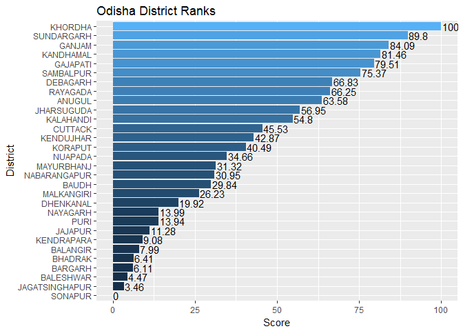

Ranking districts of Orissa
================

##### The script assigns a rank to each district of Orissa based on various socio-economic factors like education, utilities available, population and various other factors.

##### The result is at the bottom of the page.

Loading data
------------

``` r
odisha <- read.csv("odisha_census.csv")
odisha$X <- NULL
```

Structure and quick summary of data
-----------------------------------

``` r
str(odisha)
```

    ## 'data.frame':    30 obs. of  18 variables:
    ##  $ district                      : Factor w/ 30 levels "anugul","balangir",..: 1 2 3 4 5 6 7 8 9 10 ...
    ##  $ population                    : int  1140003 1337194 2024508 1346336 373372 1333749 2341094 274108 1066878 518837 ...
    ##  $ male_population               : int  587234 673985 1036511 681500 188155 675642 1207781 138408 544001 255423 ...
    ##  $ female_population             : int  552769 663209 987997 664836 185217 658107 1133313 135700 522877 263414 ...
    ##  $ growth                        : num  18.6 8 19 11 17 ...
    ##  $ rural_population              : int  981587 1182871 1804140 1242795 355347 1192678 1699964 254012 973964 465949 ...
    ##  $ urban_population              : int  158416 154323 220368 103541 18025 141071 641130 20096 92914 52888 ...
    ##  $ average_household_size        : int  5 4 5 5 4 6 5 5 5 5 ...
    ##  $ sex_ratio                     : int  941 984 953 976 984 974 938 980 961 1031 ...
    ##  $ literate_population           : int  671433 638048 1219495 749820 180321 842855 1574742 139877 639363 175850 ...
    ##  $ male_literate                 : int  409260 413224 722244 458534 119757 487993 909527 85620 377237 113924 ...
    ##  $ female_literate               : int  262173 224824 497251 291286 60564 354862 665215 54257 262126 61926 ...
    ##  $ village_count                 : int  1661 1764 2587 1180 1115 1243 1856 711 1076 1512 ...
    ##  $ water_available_village_count : int  1653 1762 2585 1180 1106 1243 1852 706 1069 1423 ...
    ##  $ power_available__village_count: int  1148 1290 2314 1154 522 973 1751 307 885 739 ...
    ##  $ school_available_village_count: int  1090 1672 1782 1134 553 954 1432 487 821 895 ...
    ##  $ permanent_house_percentage    : num  38.9 29.5 11.8 24.7 10.1 8.4 39.9 34.7 26.8 26.9 ...
    ##  $ forest_cover                  : num  42.38 14.69 9.14 16.16 40.77 ...

``` r
summary(odisha)
```

    ##       district    population      male_population   female_population
    ##  anugul   : 1   Min.   : 274108   Min.   : 138408   Min.   : 135700  
    ##  balangir : 1   1st Qu.: 693928   1st Qu.: 344547   1st Qu.: 348636  
    ##  baleshwar: 1   Median :1160320   Median : 588989   Median : 571332  
    ##  bargarh  : 1   Mean   :1226822   Mean   : 622019   Mean   : 604803  
    ##  baudh    : 1   3rd Qu.:1547163   3rd Qu.: 783374   3rd Qu.: 763789  
    ##  bhadrak  : 1   Max.   :3160635   Max.   :1581986   Max.   :1578649  
    ##  (Other)  :24                                                        
    ##      growth      rural_population  urban_population average_household_size
    ##  Min.   : 8.00   Min.   : 254012   Min.   : 18025   Min.   :4.0           
    ##  1st Qu.:13.00   1st Qu.: 623539   1st Qu.: 54484   1st Qu.:5.0           
    ##  Median :15.00   Median : 981888   Median :109928   Median :5.0           
    ##  Mean   :15.29   Mean   :1042914   Mean   :183908   Mean   :4.8           
    ##  3rd Qu.:17.00   3rd Qu.:1240915   3rd Qu.:202633   3rd Qu.:5.0           
    ##  Max.   :24.00   Max.   :2604276   Max.   :805706   Max.   :6.0           
    ##                                                                           
    ##    sex_ratio      literate_population male_literate     female_literate 
    ##  Min.   : 902.0   Min.   : 126498     Min.   :  83170   Min.   : 43328  
    ##  1st Qu.: 961.5   1st Qu.: 286386     1st Qu.: 186667   1st Qu.: 98325  
    ##  Median : 976.5   Median : 638706     Median : 393249   Median :243475  
    ##  Mean   : 976.8   Mean   : 661235     Mean   : 399744   Mean   :261491  
    ##  3rd Qu.: 997.8   3rd Qu.: 940056     3rd Qu.: 558665   3rd Qu.:374513  
    ##  Max.   :1031.0   Max.   :1631722     Max.   :1005585   Max.   :665215  
    ##                                                                         
    ##  village_count  water_available_village_count
    ##  Min.   : 346   Min.   : 346                 
    ##  1st Qu.:1131   1st Qu.:1124                 
    ##  Median :1522   Median :1475                 
    ##  Mean   :1584   Mean   :1557                 
    ##  3rd Qu.:1906   3rd Qu.:1863                 
    ##  Max.   :3748   Max.   :3658                 
    ##                                              
    ##  power_available__village_count school_available_village_count
    ##  Min.   : 100.0                 Min.   : 321                  
    ##  1st Qu.: 649.2                 1st Qu.: 822                  
    ##  Median :1012.5                 Median :1100                  
    ##  Mean   :1048.3                 Mean   :1129                  
    ##  3rd Qu.:1275.8                 3rd Qu.:1399                  
    ##  Max.   :2314.0                 Max.   :2681                  
    ##                                                               
    ##  permanent_house_percentage  forest_cover  
    ##  Min.   : 8.40              Min.   : 2.48  
    ##  1st Qu.:19.50              1st Qu.:14.75  
    ##  Median :25.25              Median :27.99  
    ##  Mean   :25.72              Mean   :28.55  
    ##  3rd Qu.:32.38              3rd Qu.:41.98  
    ##  Max.   :51.00              Max.   :66.96  
    ## 

create new variables which contribute towards scoring the district
------------------------------------------------------------------

#### Female population to Male population ratio of the district.

``` r
female_male_ratio <- odisha$female_population/odisha$male_population
```

#### Urban population to Rural population ratio.

``` r
urban_rural_ratio <- odisha$urban_population/odisha$rural_population
```

#### Literate/Total population

``` r
literate_to_population_ratio <- odisha$literate_population/odisha$population 
```

#### Female literates/Male literates

``` r
male_female_literate_ratio <- odisha$female_literate/odisha$male_literate
```

#### Proportion of villages where water is available.

``` r
water_village_ratio <- odisha$water_available_village_count/odisha$village_count
```

#### Proportion of villages where electricity is available.

``` r
electricity_village_ratio <- odisha$power_available__village_count/odisha$village_count
```

#### Proportion of villages where primary education is available.

``` r
school_village_ratio <- odisha$school_available_village_count/odisha$village_count
```

#### Total permanent houses (as a percentage to total houses)

``` r
permanent_houses <- odisha$permanent_house_percentage/100
```

#### Forest Cover Area

``` r
forest_area_percentage <- odisha$forest_cover/100
```

Creating a new data frame with variables that are significant towards the score.
--------------------------------------------------------------------------------

``` r
# create empty rank and score vectors
score <- vector(mode = "numeric", length = nrow(odisha))
rank <- vector(mode = "integer", length = nrow(odisha))

# create data frame
odisha_scored <- data.frame(rank,
                            district = odisha$district,
                            female_male_ratio,
                            growth = odisha$growth,
                            urban_rural_ratio,
                            permanent_houses,
                            forest_area_percentage,
                            literate_to_population_ratio,
                            male_female_literate_ratio,
                            water_village_ratio,
                            electricity_village_ratio,
                            school_village_ratio
                            )
```

#### Combining variables.

The female:male literate population and literate:total population both fall in the education category. We would like have only a singly parameter to measure district's education statistics. For that purpose both variables mentioned just now are combined into one by taking their averages.

``` r
education_combined <- (odisha_scored$literate_to_population_ratio + 
                        odisha_scored$male_female_literate_ratio)/2
```

Similarly combining variables related to village. Water, elecricity and primary education availability is combned into one variable by taking mean of all three.

``` r
village_score <- (odisha_scored$water_village_ratio + 
                    odisha_scored$electricity_village_ratio + 
                    odisha_scored$school_village_ratio)/3
```

Normalizing data.
-----------------

All the variables are normalized to a scale of 0 to 1 so that each feature has equal weightage.

``` r
normalize <- function(x)
{
    return((x-min(x))/(max(x)-min(x)))
}

normalized_odisha <- as.data.frame(sapply(odisha_scored[,-c(1,2)], normalize))
odisha_scored[,-c(1,2)] <- normalized_odisha
```

Calculate score by adding each feature corresponding to each district.
----------------------------------------------------------------------

``` r
odisha_scored$score <- score
odisha_scored$score <- apply(odisha_scored[,-c(1,2,10)], 1,sum)
```

Normalizing the score on a scale of 0 to 100.
---------------------------------------------

``` r
odisha_scored$normalized_score <- (100*(odisha_scored$score-min(odisha_scored$score)))/
                                    (max(odisha_scored$score) - min(odisha_scored$score))
```

Assigning rank to each district based in the normalized score.
--------------------------------------------------------------

``` r
ranked_odisha <- odisha_scored %>% arrange(desc(normalized_score)) %>%
                    mutate(rank = 1:nrow(odisha_scored))
print(odisha_scored %>% filter(rank, district, normalized_score))
```

    ## [1] rank                   district               female_male_ratio     
    ## [4] growth                 urban_rural_ratio      permanent_houses      
    ## [7] forest_area_percentage score                  normalized_score      
    ## <0 rows> (or 0-length row.names)

Visualizing ranks
-----------------

``` r
ggplot(data = ranked_odisha, aes(x = reorder(toupper(district), normalized_score),
                                 y = normalized_score, fill = normalized_score)) + 
    geom_bar(stat = "identity") + coord_flip() + 
    geom_text(aes(label = round(normalized_score,2)), hjust = -0.05) +
    theme(legend.position = "none") + 
    labs(title = "Odisha District Ranks", y = "Score", x = "District")
```



Khorda is at the top. The capital of Khorda is Bhubaneswar so it was at least expected to be in top 5. The bottom place is occupied by Malkangiri.

Thanks for being patient !
